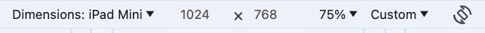

# The About Hugo Project

This is the source code of the 

[About Hugo Project](https://about-hugo.github.io/) website
located at [https://about-hugo.github.io/](https://about-hugo.github.io/).

## How to contribute

The technical process of contributing is just as with
any other open source project. See for instance GitHub's 
[Contributing to a project](https://docs.github.com/en/get-started/exploring-projects-on-github/contributing-to-a-project) tutorial
to get started.

## Note on images

The images were made with a screenshot from the devtools (settings above)

screenshots/small 

    mogrify -resize 200x200 *.jpg

screenshots/big

## Issues
- https://nuxt.com/
--

About Hugo Project © 2024 by Barne Kleinen is licensed under CC BY-NC 4.0 

https://creativecommons.org/licenses/by-nc/4.0/

https://creativecommons.org/licenses/by-nc/4.0/legalcode.de
