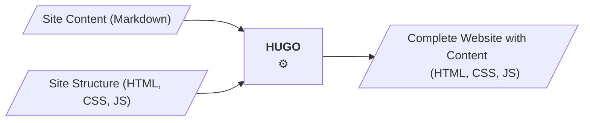

Content Creation in Hugo is done by editing markdown files. 
The site's structure is defined in templates, which are also plain text files.
Both  are usually put under version control and edited with the same tools
used in software development. 

<!--more-->




## Editing Overview

Have a look at the hugo site examples section. The [hugo-bare-bones/](/examples/hugo-bare-bones) 
example is a good starting point to explore Hugo's file structure. Basically, the generated site
mirrors the structure in the content folder.

```goat
                                                                         . 
        Hugo Source                        Generated Site    
         
      content                           public  
      └── posts                         ├── index.html
          ├── _index.md                 └── posts
          └── hello.md                      ├── hello
                                            │   └── index.html
                                            └── index.html
      layouts
      ├── _default
      │   ├── baseof.html
      │   ├── list.html
      │   └── single.html
      └── index.html
  
```

You can add new pages by either
- calling **hugo new** (e.g `hugo new content posts/second-post.md` ) which
copies a template from /archetypes, or by 
- creating a new markdown file and adding the front matter (page settings at the top of the file) manually (e.g. by copying and modifying it from another file).

## Local build

While editing your page, you can have hugo build and serve your page by calling

```bash
    hugo server
```

and access the site in your browser:
`http://localhost:1313`

If the port 1313 is not available, another port will be used. (check the output).
Call `hugo server --help` to see further options.
Calling `hugo` without `server` will only generate the site (to the /public folder) without starting a development server. This is mainly used to build the site for
production deployment. 

My practice is to create a makefile which will open the browser and start hugo with one command - have a look at the `Makefile`s in the [hugo /sites](/sites) repos. Some of the themes
(e.g. GeekDoc) use npm for a similar automation.
The hugo command currently used for this site: 

    hugo -b "http://localhost:$(port)" --enableGitInfo --navigateToChanged --buildDrafts server -p $(port)


## Markdown

Markdown is a text file format allowing for editing source files directly with as little
visual clutter as possible. I prefer to edit hugo sites in a text editor 
(currently [visual studio code](https://code.visualstudio.com/)) and have a browser
window open that displays the generated page. Hugo server will update the page automatically
after each save; with the `--navigateToChanged` option it will additionally switch to the 
current page. 

Editing Setup Screenshot

### Markdown References

- Hugo Markdown Reference | Markdown Guide: https://www.markdownguide.org/tools/hugo/
- Content formats | Hugo: https://gohugo.io/content-management/formats/
- Configure markup | Hugo: https://gohugo.io/getting-started/configuration-markup/#goldmark
- GitHub Flavored Markdown Spec: https://github.github.com/gfm/
- CommonMark Spec: https://spec.commonmark.org/0.31.2/

---
**A further Note on Markdown Editors:**
Markdown preview plugins are available for most major editors. They may be useful if you 
learn markdown or try something new and are not in an environment where the page is rendered directly - as e.g. when editing a repo readme.md page. 
If editing Hugo pages I still recommend using the page rendered by Hugo as your preview,
you see the page as it is generated by hugo with its current settings (there are many different markdown renderers and all of them are configurable!) and will encounter errors or missing parts in the site setup right away.

## Navigation

Hugo does not automatically create a complete navigation. It supports
the (semi-) automatic generation of a main menu data structure which can
then be used to render the navigation. 
The main menu can be created by either: 
- setting `sectionPagesMenu = "main"` in the config: one main menu item will be generated for each section (direct /content subfolder)
- marking pages in their front matter to be included (`menus = 'main'`)
- declare menu items in the site configuration

The [minimal-site](/examples/minimal-site/) example shows a menu in the
footer that is generated from  .Site.Menus.main
`themes/minimal-theme/layouts/partials/footer.html`. 
It also shows that the above mentioned
three ways to add items to the menu can be combined.

Hugo offers various ways to traverse the site structure which can be used
to generate a navigation without the .Site.Menus intermediary.
The [minimal-site](/examples/minimal-site/) example shows a way how the main navigation
(in layouts/partials/navigation.html) can be
automatically generated from the site structure. The [GeekDoc theme ](/themes/hugo-geekdoc-tryout/) also generates the menu in an 
elaborate and configurable way.

When choosing a theme for your site, carefully consider if the menu structure matches
your planned content. Usually this includes having a look at the source code and test if
it is extensible in the way you need. Note that most themes are categorized by their
purpose and have an according main navigation, like for instance an hierarchical structure for 
[Documentation](https://themes.gohugo.io/tags/docs/) themes or chronological posts lists for 
[Blogs](https://themes.gohugo.io/tags/blog/).

