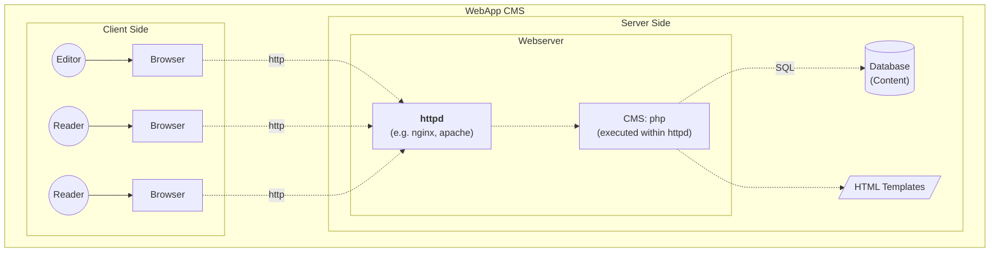

```mermaid
flowchart LR
subgraph thecms["WebApp CMS"]
direction LR


subgraph Client["Client Side"]
ed1((Editor))
re1((Reader))
re2((Reader))
  browser1
  browser2
  browser3
end


ed1 --> browser1["Browser"]
re1 --> browser2["Browser"]
re2 --> browser3["Browser"]

subgraph Server["Server Side"]
direction TB
  subgraph webserver["Webserver"]
    httpd["`**httpd**
    (e.g. nginx, apache)`"]
    CMS["CMS: php\n(executed within httpd)"]
    httpd -..->CMS
  end
CMS -..->|SQL|db
CMS -..->templates
db[("Database\n(Content)")]
templates[/HTML Templates/]
end

browser1 -..->|http| httpd

browser2 -..->|http| httpd

browser3 -..->|http| httpd
end
```