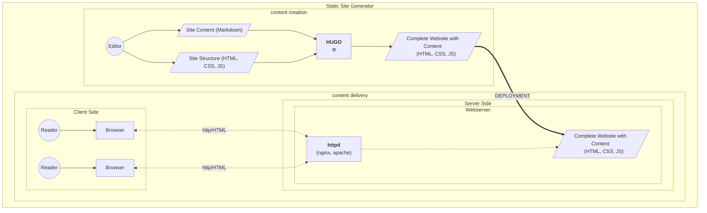

A Hugo site is published by copying it (deploying it) to any web server which 
then makes it available to the readers (via the http protocol, the delivery).
A web server is a machine running a http server like [Apache](https://httpd.apache.org/) or [NGINX](https://www.nginx.com/).The deployment can be automated using Continuous Deployment practices.
<!--more-->

The [examples](/examples) and [theme tryouts](/themes) on this page are all automatically build and deployed by [Github Actions](https://github.com/features/actions). The Workflow definition files can be found in the repos in `.github/workflows`.

## Deployment Pipeline

The [hugo-bare-bones](/examples/hugo-bare-bones) example contains a complete pipeline with a separate jobs for the build, test and deploy stages: 
https://github.com/about-hugo/hugo-bare-bones/actions/workflows/pipeline.yml

If a github action workflow is split into jobs, they are shown visually in the interface:

## Continuous Delivery

[Continuous Delivery](https://martinfowler.com/bliki/ContinuousDelivery.html)

## Continuous Integration

Martin Fowler defines [Continuous Integration](https://martinfowler.com/articles/continuousIntegration.html) as "a software development practice where each member of a team merges their changes into a codebase together with their colleagues changes at least daily" (Fowler 2024)

While creating content for hugo web sites is not software development per se, the practices and tools, especially git knowledge that is needed for continuous integration can be teached, learned and practiced using a hugo site.

## References

(Fowler 2024): Fowler, Martin: Continuous Integration. Bliki-Article, 18.1.2024, https://martinfowler.com/articles/continuousIntegration.html , accessed 11.5.2024

(Fowler 2013): Fowler, Martin: Deployment Pipeline, Bliki-Article, 30.5.2013, 
https://martinfowler.com/bliki/DeploymentPipeline.html , accessed 11.5.2024

Continuous Delivery, Bliki-Article, 30 May 2013, https://martinfowler.com/bliki/ContinuousDelivery.html , accessed 11.5.2024

