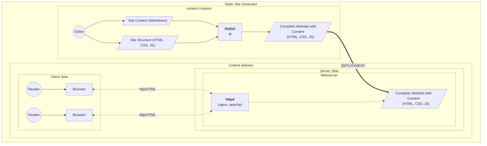
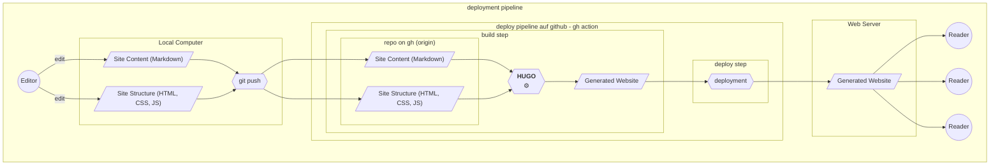

A Hugo site is published by copying it (deploying it) to any web server which 
then makes it available to the readers (via the http protocol, the delivery).
A web server is a machine running http server software like [Apache](https://httpd.apache.org/) or [NGINX](https://www.nginx.com/).The deployment can be automated using Continuous Deployment practices.

<!--more-->

## Deployment

The diagram below, introduced on the  [Content Creation and Delivery Processes](/hugo/process/) page, 
shows the content creation process done with hugo and the content delivery process based on the generated web site as independent processes. They are in fact technologically independent stacks.

The only link between them is the deployment of the generated site on the web server's file system, which can be done with any means, manual or 
automated, to copy a file from one computer to another.

## Deployment Pipeline
The [examples](/examples) and [theme tryouts](/themes) on this page are all automatically build and deployed with [Github Actions](https://github.com/features/actions). The Workflow definition files can be found in the repos in 
the `.github/workflows` folders. Most of these workflows are quite simple, they combine the hugo site generation (build step) with the deployment to gh pages (deployment step) in one github action job.  They also do not contain explicit tests. However, they would fail (and stop the pipeline) if the hugo build fails.

The [hugo-bare-bones](/examples/hugo-bare-bones) example contains a more complete pipeline with separate jobs for the build, test and deploy stages: 
https://github.com/about-hugo/hugo-bare-bones/actions/workflows/pipeline.yml

This workflow is split into three jobs, as github actions only shows these as separate build pipeline steps:

Build Pipeline in Github Actions Visualization

### Hugo Deployment Pipeline
The pipeline consists of the following steps:
1. **git push:** the editor performs a git push
2. GitHub Actions starts the gh action workflow: 

    3. **build**: the hugo site is build on gh. (after checkout, installation of necessary software)
    4. **test**: automated tests are executed
    5. **deploy**: the generated site is deployed to the server

### Notes on the Pipeline Steps

#### 1. **git push:** the editor performs a git push
As with software development, the source code of the hugo web site is shared via a central git repository.
Automated Build- and Test Runs are triggered by changes to the repository. These can be configured. The example sites
perform a build for every push, and the deployment only for every push on the main branch.

Generated Files -- like the generated site -- are usually not included in the source code repository. This would be redundant;  also, rebuilding the site constitutes a test that the build works in a reproducible way.

#### 2. GitHub Actions starts the gh action workflow: 
Via the on: push directive in the examples. 

#### 3. **build**: the hugo site is build on gh. (after checkout, installation of necessary software)
This does constitute a test. (see above)

#### 4. **test**: automated tests are executed
Hugo web sites could be tested
automatically by checking for failing links, checking the validity of HTML, running automated accessibility checks and much more. The [hugo-bare-bones](/examples/hugo-bare-bones/) contains an example how the site can be tested using 
Cypress, which allows for full end2end testing of the website. Cypress could even be used to test wether all
mermaid diagrams could be rendered on the site (they are rendered by javascript in the browser)

#### 5. **deploy**: the generated site is deployed to the server

## Notes on Terminology

Within the dev/ops community, Continuous Delivery is the extension of Continuous Integration 

## Continuous Delivery

[Continuous Delivery](https://martinfowler.com/bliki/ContinuousDelivery.html)

## Continuous Integration

Martin Fowler defines [Continuous Integration](https://martinfowler.com/articles/continuousIntegration.html) as "a software development practice where each member of a team merges their changes into a codebase together with their colleagues changes at least daily" (Fowler 2024)

While creating content for hugo web sites is not software development per se, the practices and tools, especially git knowledge that is needed for continuous integration can be teached, learned and practiced using a hugo site.

## References

(Fowler 2024): Fowler, Martin: Continuous Integration. Bliki-Article, 18.1.2024, https://martinfowler.com/articles/continuousIntegration.html , accessed 11.5.2024

(Fowler 2013): Fowler, Martin: Deployment Pipeline, Bliki-Article, 30.5.2013, 
https://martinfowler.com/bliki/DeploymentPipeline.html , accessed 11.5.2024

Continuous Delivery, Bliki-Article, 30 May 2013, https://martinfowler.com/bliki/ContinuousDelivery.html , accessed 11.5.2024

