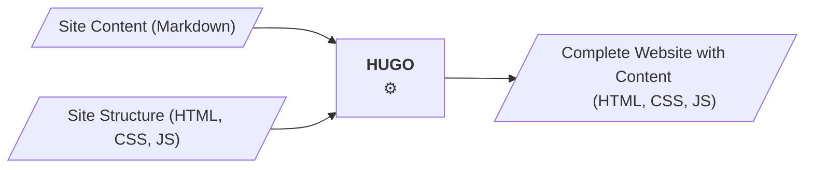

As a static site generator, hugo takes the site structure and the site content (in markdown format) and
generates a static web site. The complete web site - HTML, CSS, JS in a directory structure - is then copied to the 
web server, which only needs to serve these static files.
<!--more-->

## Static Site Generator

As a static site generator, hugo takes the site structure and the site content (in markdown format) and
generates a static web site:




## Why?

Very simply said, Hugo solves the problem every web site (consisting of more than one page) has: 
Combining an overall Site structure, such as Header, Footer and especially a uniform Navigation,
with the Site Contents.

```goat
                                                                                                .
    .-----+-----+-----.                  
    | Header          |
    +-----+-----------+ 
    |     |           | 
    |     |           | 
    |     |           | 
    | Nav.| Content   | 
    |     |           | 
    |     |           | 
    |     |           | 
    +-----+-----+-----+ 
    | Footer          |
    '-----+-----+-----'

```
*Simple Site Structure*

While Header, Navigation and Footer should stay stable, the Content needs to be replaced:
```goat
                                                                                                .

   .-----+-----+-----.
   | Header          |
   +-----+-----------+            +-----+-----+           +-----+-----+           +-----+-----+
   |H    |           |            |           |           |           |           |           |
   |│    |           |            |           |           |           |           |           |
   |├─A  |           |            |           |           |           |           |           |
   |│    | Content H |    <--     | Content A |   <--     | Content B |   <--     | Content C |
   |├─B  |           |            |           |           |           |           |           |
   |│    |           |            |           |           |           |           |           |
   |└─C  |           |            |           |           |           |           |           |
   +-----+-----+-----+            +-----+-----+           +-----+-----+           +-----+-----+
   | Footer          |
   '-----+-----+-----'
```
*Combine Content Pages with Site Structure*

This is, of course, a simplification. Note that I summarize site layout and css as site structure.

## Hugo im Vergleich zu anderen CMS

Unter dem Begriff "CMS" (Content Management System) werden meistens Web-Applikationen verstanden, die 
das Eingeben und Erstellen von Inhalt, das Generieren der Seiten sowie das ausliefern in einer Web-Applikation
integrieren - diese App läuft dann auf dem Server (typische 3-Tier Web-App). So schreibt der Provider IONOS
auf seinen Dokumentationsseiten:

> Bei einem Content Management System (CMS) handelt es sich um eine Software, mit der Anwender Webinhalte – wie beispielsweise Texte oder Multimedia-Elemente – auch ohne Programmierkenntnisse gemeinschaftlich über eine grafische Benutzeroberfläche erstellen, bearbeiten und veröffentlichen können.
[ionos1]

(Die genaue Abgrenzung von CMS, Web-CMS sowie Website-Generatoren ist etwas komplexer, TBD)


[ionos1]: CMS Vergleich 2024: Die besten CMS Systeme im Check - IONOS: https://www.ionos.de/digitalguide/hosting/cms/cms-vergleich/, zugegriffen am 10.5.2024

[ionos2]: Was ist ein Static-Site-Generator? - IONOS: https://www.ionos.de/digitalguide/websites/webseiten-erstellen/was-ist-ein-static-site-generator/, zugegriffen am 10.5.2024


## Editing Publishing Separation

Most known Web Content Management Systems (like Wordpress, Typo3, Drupal) are Web-Applications
which integrate content editing and publication in one single application. Their 

Martin Fowler characterized content management systems (CMS) as a "worryingly invasive tool" [Fowler 2012],
pointing out that CMS often handle the two processes of editing and publishing in one single system, 
while most web pages have a small group of editors and a larger group of readers, with content that 


[Fowler 2012]: Fowler, Martin: Editing Publishing Separation: https://martinfowler.com/bliki/EditingPublishingSeparation.html - Blog Article, 24.4.2012, accessed 10.5.2024