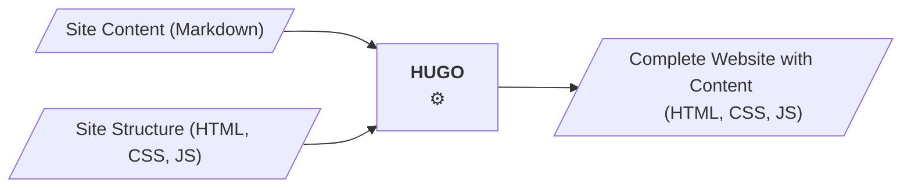

As a static web site generator, hugo takes the site structure and the site content (in markdown format) and generates the complete web site. The web site - HTML, CSS, JS in a directory structure - is then copied to the web server. The web server then only serves static files, with no need to invoke scripts or to access a database.
<!--more-->

## Static Site Generator

As a static web site generator, hugo takes the site structure and the site content (in markdown format) and
generates a static web site:




## Why?

Very simply said, Hugo solves the problem every web site (consisting of more than one page) has: 
Combining an overall Site structure, such as Header, Footer and especially a uniform Navigation,
with the Site Contents.

```goat
                                                                                                .
    .-----+-----+-----.                  
    | Header          |
    +-----+-----------+ 
    |     |           | 
    |     |           | 
    |     |           | 
    | Nav.| Content   | 
    |     |           | 
    |     |           | 
    |     |           | 
    +-----+-----+-----+ 
    | Footer          |
    '-----+-----+-----'

```
*Simple Site Structure*

While Header, Navigation and Footer should stay stable, the Content needs to be replaced:
```goat
                                                                                                .

   .-----+-----+-----.
   | Header          |
   +-----+-----------+            +-----+-----+           +-----+-----+           +-----+-----+
   |H    |           |            |           |           |           |           |           |
   |│    |           |            |           |           |           |           |           |
   |├─A  |           |            |           |           |           |           |           |
   |│    | Content H |    <--     | Content A |   <--     | Content B |   <--     | Content C |
   |├─B  |           |            |           |           |           |           |           |
   |│    |           |            |           |           |           |           |           |
   |└─C  |           |            |           |           |           |           |           |
   +-----+-----+-----+            +-----+-----+           +-----+-----+           +-----+-----+
   | Footer          |
   '-----+-----+-----'
```
*Combine Content Pages with Site Structure*

This is, of course, a simplification. Note that I summarize site layout and css as site structure.

