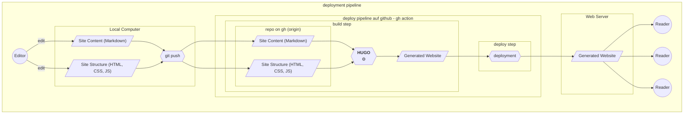

<!-- more -->

## Pipeline v1

```mermaid

flowchart TD
subgraph cc["deployment pipeline"]
direction LR
    ed1((Editor))

    subgraph hsou["Local Computer"]
    content[/"Site Content (Markdown)"/]
    structure[/"Site Structure (HTML, CSS, JS)"/]
     push{{git push}}
    end
    

    content-->push-->content2
    structure-->push-->structure2
   

    subgraph ghhs2["deploy pipeline auf github - gh action"]
    direction LR
    subgraph build["build step"]
    subgraph ghhs["repo on gh (origin)"]
      
      content2[/"Site Content (Markdown)"/]
      structure2[/"Site Structure (HTML, CSS, JS)"/]
      end
      hugo{{"`
    **HUGO**
     ⚙️ `"}}
     website[/"Generated Website"/]
     end
     
     subgraph deploystep["deploy step"]
         
     deploy{{deployment}}
    end
    end
    website-->deploy-->website2
   
    subgraph httpd["Web Server"]
        website2[/"Generated Website"/]
    end

    content2 & structure2 --> hugo
    hugo --> website
    ed1 -->|edit|content
    ed1 -->|edit|structure
    
    re1((Reader))
    re2((Reader))
    re3((Reader))
    website2 --> re1 & re2 & re3


     
end
```