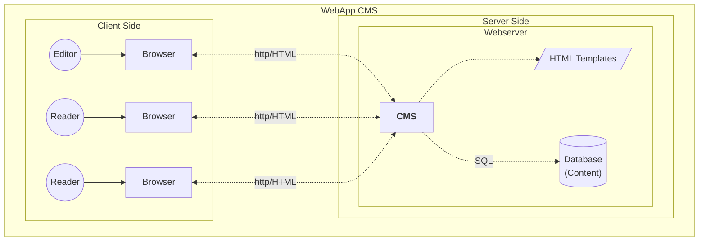
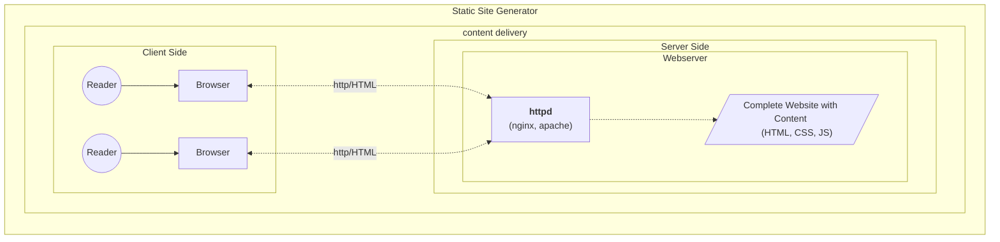
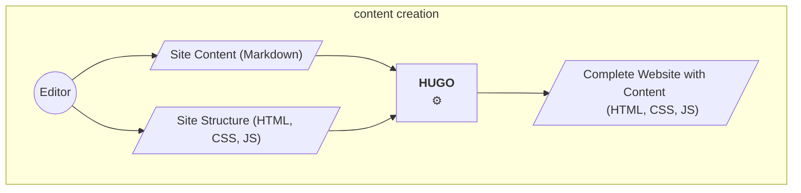
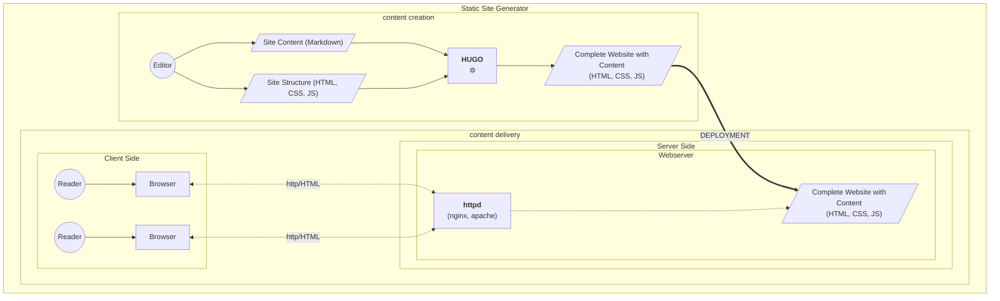
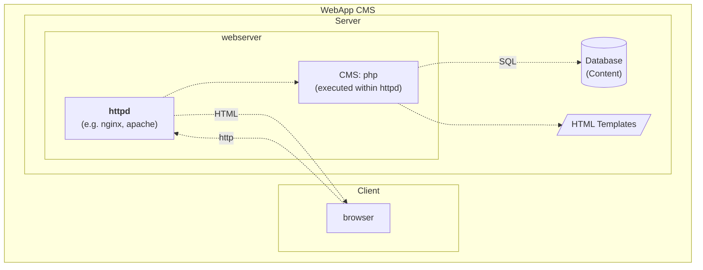
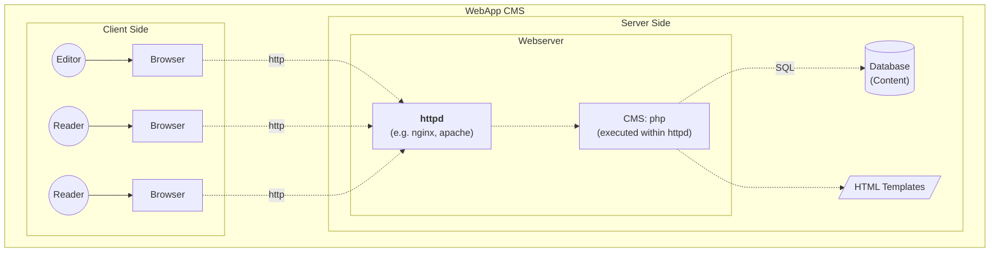

Most known Web Content Management Systems (like Wordpress, Typo3, Drupal) are Web-Applications
which integrate content editing and publication in one single application. With a static
site generator, these process steps are divided: Content creation is done on your
local computer, and content delivery is done by a static web server like nginx or apache.
<!--more-->

## Editing Publishing Separation
Fowler and Parekh [(Fowler 2012, Parekh and Fowler 2014)](#references) propose a 
separation between editing and publishing of web sites using two
separate stacks - the content creation stack and the content delivery stack. 
I will use a terminology based on this differentiation. [See the note about terminoloy below.](#note-2-terminology)

## WebApp CMS: Content Creation and Delivery through one Software

With CMS built as Web Apps, e.g. with the LAMP Stack ([see note 3](#note-3-lamp-stack)),
 Editing and Publishing is both done through the same App - the "CMS" like Wordpress, Typo3 etc.:

## SSG: Content Delivery
With a static site generator like hugo, these processes are split up. The Content Delivery
can be done by a web server like nginx or apache directly (without executing any scripts), as only static sites need to be served by
the web server.

## SSG: Content Creation
With a static site generator, content creation is done by editing text files on the editor's local computer.
Typical text file formats are markdown for content and HTML templates for the site structure - Go Templates within Hugo. Both can be edited with any Text editor or IDE.

## SSG: Deployment

To publish the site generated by the SSG (Hugo), it has to be copied to the web server. 
This can be done with a manual copy, but is usually done with some kind of automated build process.
See the page on [deployment](../deployment).

### Notes
###### Note 1: Web Sites vs. Web Apps
Fowler (2012) also points out that some web pages - for example those with user generated content - will
be edited by many users, as for instance Wikis. I use the following differentiation: A **Web Site** is a collection of Web Pages (single html files) that constitute a unit of published information, and are typically accessible under a specific (sub)domain. They are published by few people, sometimes only one person. **Web Apps** are Applications build with Web Tools, based on the Web Client-Server Model, but apart from this technological similarity, are closer to software (applications) in general. Thus, I would characterize Wikis, Shop Systems and the like as Web Apps, not Web Sites. As with most categorizations, the
boundaries are not clear cut, but careful differentiations are necessary nonetheless. This website is concerned with the creation of **Web Sites** with the described characteristic of being edited by few and read by many, and content that will be more often read (hopefully) than changed after once being published. 

###### Note 2: Terminology

Martin Fowler (2012) proposes the separation of web page editing and publishing. 
He characterizes content management systems (CMS) as a "worryingly invasive tool",
pointing out that CMS often handle the two processes of editing and publishing in one single system, 
while most web pages have a small group of editors and a larger group of readers, with content that,
once it is published, will only rarely be changed again. (see also [Note 1](#note-1-web-sites-vs-web-apps)).

Parekh and Fowler (2024) use the terms "Content Creation Stack" and "Content Delivery Stack" for the
two systems that should be built to handle these two concerns. This proposal addresses
issues of large sites with significant traffic, which is different from the web sites I am concerned with here, 
but I will use their terminology nonetheless as it helps clarify the different architectures.

#### Note 3: Lamp Stack
The acronym LAMP stands for Linux, Apache, MySQL, PHP ([3]) and is an often used open source stack
for web applications. PHP runs within the Apache webserver and is connected to a MySQL database.
Most common CMS are built on this stack - as for instance Wordpress, Typo3 or Drupal.

While this is a well-known and powerful stack, it has two main drawbacks for simple web sites:
- it includes the execution of a script on the server side, which may be a security risk and thus requires regular updates.
- a database is required
- both results in a more complex server setup and maintenance if you run your own server, or in 
higher hosting costs if you use a hosted solution.

**Own Deployment Diagram for a CMS like Wordpress, see also (WordPress 2024)**

##### No Editing/Publishing separation
The diagram below shows one editor and two readers. With a WebApp CMS, editing and publishing is done through the same app, which also means that the editing possibility has to be kept open even if the site is not currently changed. 

[3]: https://de.wikipedia.org/wiki/LAMP_(Softwarepaket)

### References
(Fowler 2012): Fowler, Martin: Editing Publishing Separation. Blog Article, 24.4.2012, https://martinfowler.com/bliki/EditingPublishingSeparation.html, accessed 10.5.2024

(Parekh and Fowler 2014): Parekh, Sunit and Fowler, Martin: Two Stack CMS. Building a Two-stack CMS for a global product catalog. Slidedesk, 6.10.2014, https://martinfowler.com/articles/two-stack-cms/ , accessed 10.5.2024

(WordPress 2024): Advanced Administration Handbook. Technical Documentation 28.3.2023-21.2.2024, https://developer.wordpress.org/advanced-administration/ , accessed 10.5.2024

