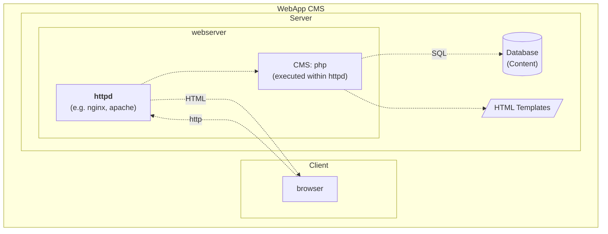
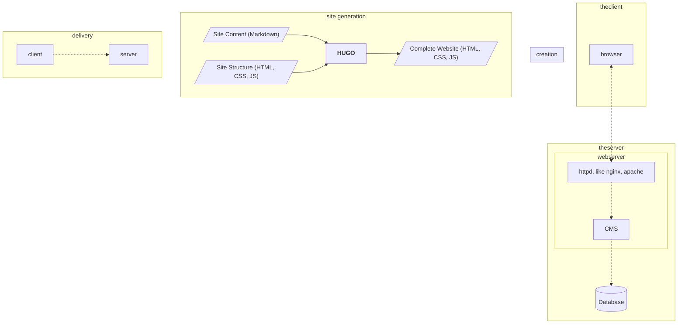

Most known Web Content Management Systems (like Wordpress, Typo3, Drupal) are Web-Applications
which integrate content editing and publication in one single application. With a static
site generator, these process steps are divided: Content creation is done on your
local computer, and content delivery is done by a static web server like nginx or apache.
<!--more-->

## Editing Publishing Separation

The following builds on a blog article by Martin Fowler (2012), in which he
characterizes content management systems (CMS) as a "worryingly invasive tool",
pointing out that CMS often handle the two processes of editing and publishing in one single system, 
while most web pages have a small group of editors and a larger group of readers, with content that,
once it is published, will only rarely be changed again. (see also [Note 1](#note-1-web-sites-vs-web-apps)).

Own Deployment Diagram for a CMS like Wordpress, see also (WordPress 2024)

### References
(Fowler 2012): Fowler, Martin: Editing Publishing Separation. Blog Article, 24.4.2012, https://martinfowler.com/bliki/EditingPublishingSeparation.html, accessed 10.5.2024

(WordPress 2024): Advanced Administration Handbook. Technical Documentation 28.3.2023-21.2.2024, https://developer.wordpress.org/advanced-administration/ , accessed 10.5.2024

### Notes
###### Note 1: Web Sites vs. Web Apps
Fowler (2012) also points out that some web pages - for example those with user generated content - will
be edited by many users, as for instance Wikis. I use the following differentiation: A **Web Site** is a collection of Web Pages (single html files) that constitute a unit of published information, and are typically accessible under a specific (sub)domain. They are published by few people, sometimes only one person. **Web Apps** are Applications build with Web Tools, based on the Web Client-Server Model, but apart from this technological similarity, are closer to software (applications) in general. Thus, I would characterize Wikis, Shop Systems and the like as Web Apps, not Web Sites. As with most categorizations, the
boundaries are not clear cut, but careful differentiations are necessary nonetheless. This website is concerned with the creation of **Web Sites** with the described characteristic of being edited by few and read by many, and content that will be more often read (hopefully) than changed after once being published. 

[foo]: http://martinfowler.com

