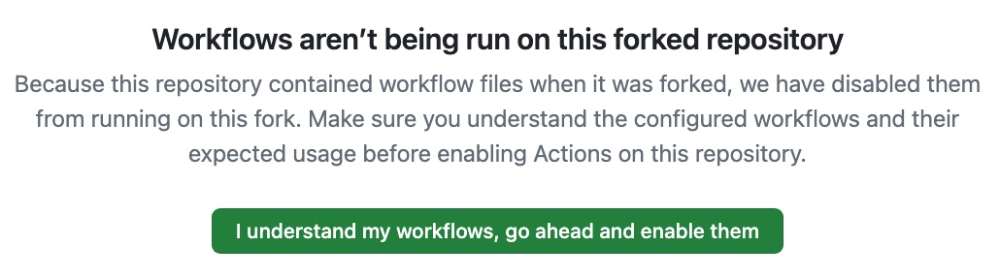
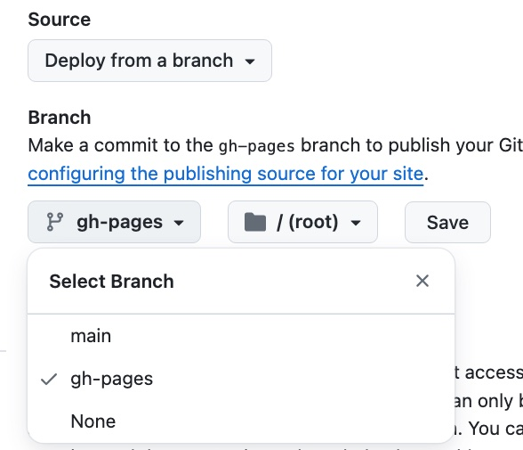

You can quickly get started with a deployed site on github by forking
one of the example sites.

<!--more-->

1. Fork one of the [Example](/examples) or [Theme Tryout](/themes) sites
2. Enable workflows for the fork
3. Trigger a workflow run
4. Enable gh pages for your repo
5. Clone your repo to your computer
6. Install Hugo 
7. Call hugo server

##### 1. Fork one of the [Example](/examples) or [Theme Tryout](/themes) sites
Go to the github repo of the example/theme tryout and click fork: 
##### 2. Enable workflows for the fork
In your own (forked) repo, go to the Actions section, then enable workflows:

##### 3. Trigger a workflow run
go to the Actions section. If the workflow has a manual run button, run it:
 - this creates the gh-pages branch which is needed
to enable github pages. You can also trigger a build by pushing to the repo.
##### 4. Enable gh pages for your repo
Go to settings/pages and 
choose "deploy from branch". To be able to do so, the gh-pages branch must have been
created beforehand.

After this, the page should start to build. To check this, go to the gh actions page. You
should see the first page deployment in progress:

##### 5. Clone your repo to your computer
git clone ....
##### 6. Install Hugo 

See  Installation | Hugo: https://gohugo.io/installation/

##### 7. Call hugo server

cd into your local copy and run

    hugo server

Have fun!

## Further Reading

- Quick start | Hugo: https://gohugo.io/getting-started/quick-start/
- Getting started | Hugo: https://gohugo.io/getting-started/

